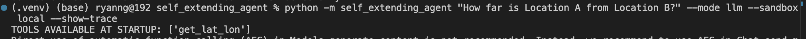
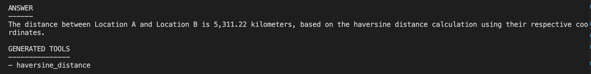
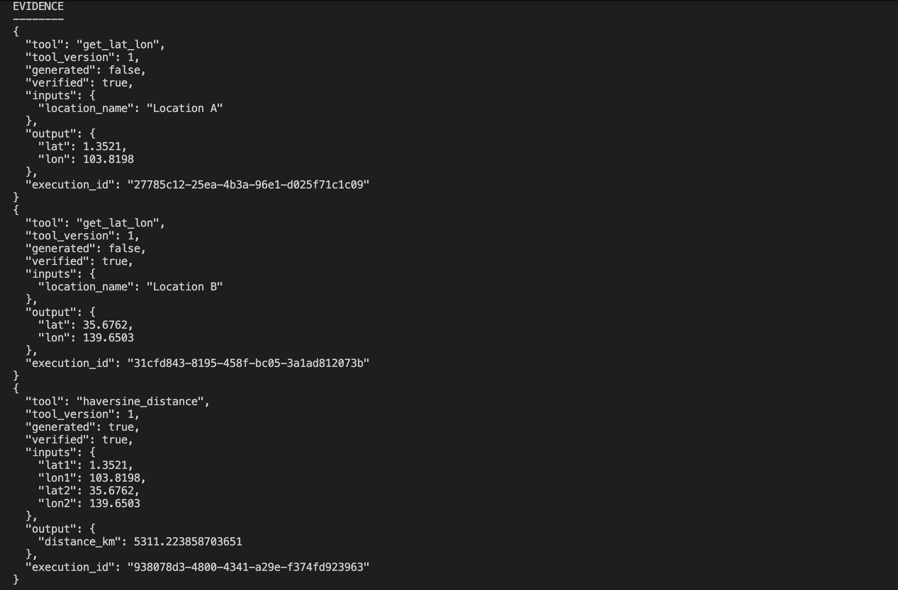
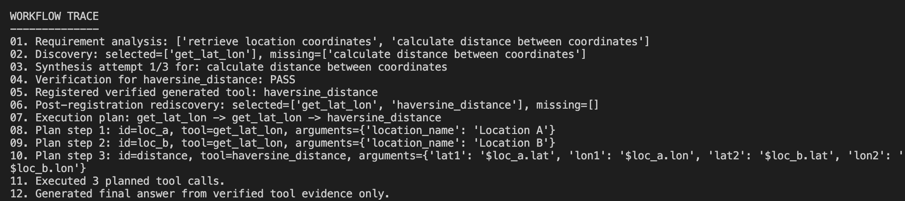
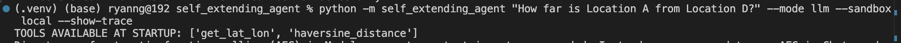
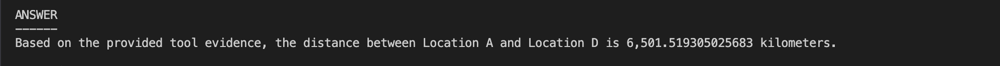
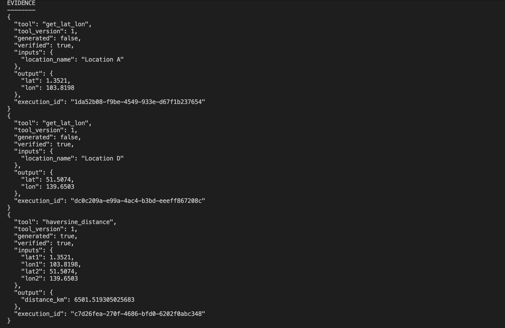
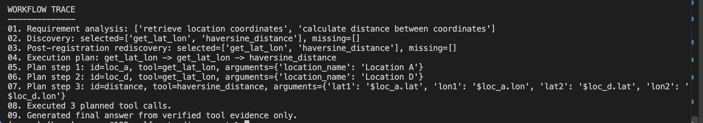

# To Start
# Installation

From the project directory:

```bash
python -m venv .venv
```

Install:

```bash
pip install -e ".[dev]"
```

To test, run this:
```
python -m self_extending_agent "How far is Location A from Location B?" --mode llm --sandbox local --show-trace
```

<!-- For Daytona support:

```bash
pip install -e ".[dev,daytona]"
``` -->

---

# Problem Statement

Create a self building tool agent that:

1. starts with an approved set of tools,
2. analyzes a user's request into required capabilities,
3. exhaustively searches the full existing tool registry first,
4. enters tool synthesis only when a required capability is genuinely missing,
5. generates a narrowly scoped tool,
6. statically checks and sandbox-tests the generated code,
7. registers the tool only after successful verification,
8. restarts discovery/planning with the updated toolkit,
9. executes the request using tools, and
10. creates the final answer only from recorded, verified tool outputs.

----

This specific demo is to simulate the situation where:
- Agent is already given the getLatLon tool from backend

- When asked what is the distance between 2 locations, it will:
    1. run getLatLon (given by backend) on the two given locations
    2. run getDistance (built by AGENT), 
    3. generate this tool in generated_tools folder 
    4. return result if non null.
- When asked again on what is the distance between 2 other locations, it should not regenerate above tool, and use previously generated tool to answer.

----

# Expected Results:
Question to agent: 
How far is Location A from Location B

1. Check that available tools initially is only get_lat_lon



----

2. Agent Answer + here we are able to see generated tools, check generated_tools folder to confirm




----

3. Agent Tool Usage Rundown (Able to see which tools are used , able to see which are generated and which are not)



----

4. Agent Trace (Use this to verify each step from input -> tool generation -> tool planning -> tool execution -> answer)



----

5. Restart Process with Location A and D this time

Question: How far is Location A from Location D

----

6. Check that generated tool is listed in the registry


----

7. Agent Answer + No Additional tool is generated


----

8. Agent Tool Usage Rundown 


----

9. Verify that generated tool was used instead of generating AGAIN (In step 2, can see that agent discovered check_haversine_distance, hence did not regenerate tool)


----

The central design principle is:

> **Tool synthesis is a fallback, never the default. If the system cannot produce verified evidence, it fails explicitly instead of fabricating an answer.**

---

## 1. Architecture

```text
                              +----------------------+
                              | Existing Tool        |
                              | Registry             |
                              +----------+-----------+
                                         |
                                         v
+------+    +------------------+    +------------------+
| User | -> | Requirement      | -> | Mandatory Tool   |
+------+    | Analysis         |    | Discovery        |
            +------------------+    +--------+---------+
                                              |
                         +--------------------+--------------------+
                         |                                         |
                    all covered                              capability missing
                         |                                         |
                         v                                         v
                +------------------+                    +------------------+
                | Normal Agent     |                    | Tool Synthesis   |
                | Execution        |                    +--------+---------+
                +------------------+                             |
                                                                 v
                                                      +--------------------+
                                                      | Static Validation  |
                                                      +---------+----------+
                                                                |
                                                                v
                                                      +--------------------+
                                                      | Sandbox Tests      |
                                                      +---------+----------+
                                                                |
                                                    +-----------+----------+
                                                    |                      |
                                                  FAIL                    PASS
                                                    |                      |
                                                    v                      v
                                              retry / fail        +----------------+
                                                                  | Register Tool  |
                                                                  +-------+--------+
                                                                          |
                                                                          v
                                                               restart discovery
                                                                          |
                                                                          v
                                                                  normal execution
```


---

## 2. Main guarantees

### 2.1 Existing tools are searched first

`ToolRegistry.catalogue_text()` exposes the complete current registry to the discovery stage.

The discovery prompt explicitly requires:

- inspection of the entire catalogue,
- preference for composition of existing tools,
- exact registered tool names,
- missing capabilities only when existing tools cannot satisfy them.

The code then validates that any selected tool name really exists.

This is stronger than putting a `create_tool()` function beside all normal tools and hoping the LLM chooses responsibly.

### 2.2 Generated code is never trusted just because an LLM wrote it

A synthesized tool goes through:

```text
LLM source
   |
   v
AST/static checks
   |
   v
sandbox verification
   |
   v
persist + register
```

Only a passing tool is made available to the execution agent.

### 2.3 Failure is preferable to hallucination

If a tool cannot be generated and verified within `MAX_TOOL_GENERATION_ATTEMPTS`, the workflow stops.

It returns an explicit failure message instead of asking the LLM to "do its best" and potentially invent a computed value.

### 2.4 The final answer is evidence-grounded

Every executed tool produces a `ToolExecutionRecord`:

```json
{
  "tool": "calculate_geographic_distance",
  "tool_version": 1,
  "generated": true,
  "verified": true,
  "inputs": {
    "lat1": 1.3521,
    "lon1": 103.8198,
    "lat2": 35.6762,
    "lon2": 139.6503
  },
  "output": {
    "distance_km": 5312.0
  },
  "execution_id": "..."
}
```

The answer-generation stage is told to use only those records.

This does **not** make an LLM mathematically incapable of hallucinating. Instead, it changes the system guarantee to a defensible engineering statement:

> The application does not accept unsupported factual/computed results as evidence. Answers requiring computation must be backed by recorded tool execution.

---

# 3. Project structure

```text
self_extending_agent/
|
+-- pyproject.toml
+-- .env.example
+-- README.md
+-- src/
|   +-- self_extending_agent/
|       +-- __main__.py
|       +-- cli.py
|       +-- config.py
|       +-- models.py
|       +-- workflow.py
|       +-- agent_executor.py
|       +-- demo_executor.py
|       +-- dynamic_tools.py
|       +-- generated_store.py
|       |
|       +-- data/
|       |   +-- locations.json
|       |
|       +-- tools/
|       |   +-- builtin.py
|       |   +-- registry.py
|       |   +-- types.py
|       |
|       +-- llm/
|       |   +-- base.py
|       |   +-- demo.py
|       |   +-- factory.py
|       |   +-- langchain_model.py
|       |
|       +-- sandbox/
|           +-- base.py
|           +-- factory.py
|           +-- local.py
|           +-- daytona_backend.py
|           +-- static_checks.py
|
+-- tests/
    +-- test_static_checks.py
    +-- test_workflow.py
```

Generated tools are created at runtime under:

```text
generated_tools/
  generated_tool/
    tool.py
    manifest.json
    generated_tests.json
```

---

# 4. What kinds of tools should be eligible for synthesis?

Good candidates:

```text
mathematical calculations
data transformations
format conversion
sorting/ranking algorithms
geometry
statistics
parsing trusted input
pure deterministic business rules
```

Bad candidates for unrestricted automatic synthesis:

```text
database writes
filesystem deletion
sending messages
financial transactions
credential access
production deployments
arbitrary HTTP requests
privileged shell execution
```


# 5. Summary

```text
User Request
     |
     v
Requirement Analysis
     |
     v
Full Tool Discovery
     |
     +---------- existing capabilities ----------+
     |                                           |
     |                                      missing capability
     |                                           |
     |                                           v
     |                                     Tool Synthesis
     |                                           |
     |                                           v
     |                                     Static Validation
     |                                           |
     |                                           v
     |                                     Sandbox Testing
     |                                           |
     |                                           v
     |                                      Registration
     |                                           |
     +------------------< rediscovery <-----------+
     |
     v
Agent Tool Execution
     |
     v
Execution Evidence
     |
     v
Evidence-Grounded Answer
```

The most important architectural invariant is still:

> **Use the existing toolkit first. Synthesize only when required. Verify before registration. Answer from evidence. Fail rather than fabricate.**
